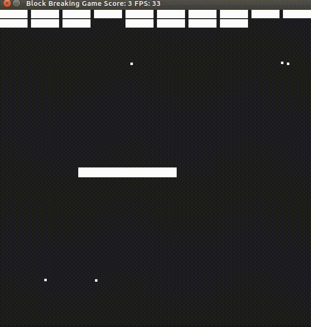
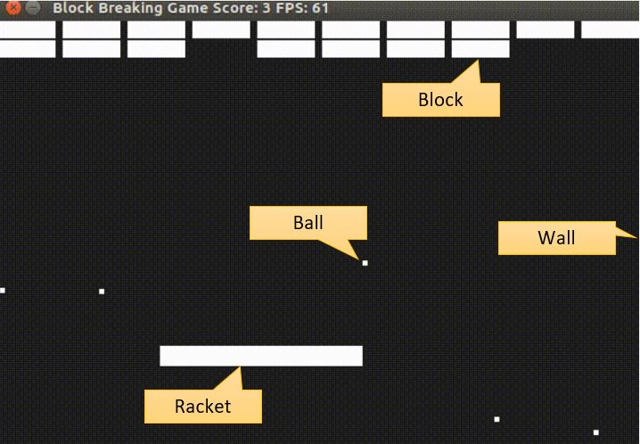
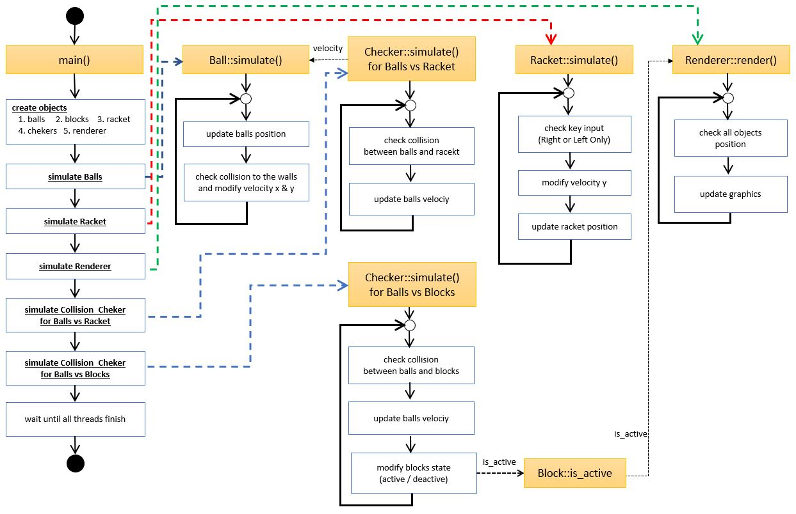

# CPPND: Capstone : Block Breaking Game

This is a repo for the Capstone project in the [Udacity C++ Nanodegree Program](https://www.udacity.com/course/c-plus-plus-nanodegree--nd213). The code for this repo was inspired by [this](https://codereview.stackexchange.com/questions/212296/snake-game-in-c-with-sdl) excellent StackOverflow post and set of responses.

    

# Project Specifications

## Criteria 1 (required) : A README with instructions is included with the project

### 1-1 : The README is included with the project and has instructions for building/running the project.

 

### Dependencies for Running Locally
* cmake >= 3.7
  * All OSes: [click here for installation instructions](https://cmake.org/install/)
* make >= 4.1 (Linux, Mac), 3.81 (Windows)
  * Linux: make is installed by default on most Linux distros
  * Mac: [install Xcode command line tools to get make](https://developer.apple.com/xcode/features/)
  * Windows: [Click here for installation instructions](http://gnuwin32.sourceforge.net/packages/make.htm)
* SDL2 >= 2.0
  * All installation instructions can be found [here](https://wiki.libsdl.org/Installation)
  * Note that for Linux, an `apt` or `apt-get` installation is preferred to building from source.
* gcc/g++ >= 5.4
  * Linux: gcc / g++ is installed by default on most Linux distros
  * Mac: same deal as make - [install Xcode command line tools](https://developer.apple.com/xcode/features/)
  * Windows: recommend using [MinGW](http://www.mingw.org/)

### Basic Build Instructions

1. Clone this repo.
2. Move to the folder "CppND-Capstone-Block-Breaking"
2. Make a build directory in the top level directory: `mkdir build && cd build`
3. Compile: `cmake .. && make`
4. Run it: `./Block_Breaking`.
   

## Criteria 2 (required) : The README indicates which project is chosen.

### 2-1 : The README describes the project you have built.
* I chose the video game as my project program.
* The game name is "Block Breaking game".
* The game has 4 types of objects.
  * 1 : blocks -> To get socres, players have to break blocks.
  * 2 : balls -> When balls hit the blocks, blocks break.
  * 3 : racket -> To controll ball movemnets, racket can reflect balls.
  * 4 : wall -> Balls reflect by 4 walls (up,down.right,left).

 

### 2-2 : The README also indicates the file and class structure, along with the expected behavior or output of the program.
* My program consists of 7 .cpp files.

* reference : program structure

* 1 : main.cpp
  * main.cpp creates all objects and they are created as ***shared_ptr***.
  * All calulations are done in ***other threads***. After all threads are joined, this programm finished.
  * To stop this program, clicke ***X*** button on the GUI.
  * In this file, players can modify the number of balls and blocks.

* 2 : BaseObject.cpp/.h
  * This file has `BaseObject` class.
  * `BaseObject` is a super class of `Ball`, `Racket` and `Block` classes.
  * `BaseObject` provides common members such as position, velocity, size and etc.
  * This program does not have an object for Walls. Instead, `BaseObject` has window_width and window_height as static members. To calculate the collision of Walls , Balls and Racket , these 2 members are used.
  * To create ***thread barrier***, `BaseObject::~BaseObject()`(destructor) do `std::thread::join()` for all ***thread***.
  * `BaseObject::simulate()` and `BaseObject::calc()` are ***virtual functions***. They are overrided by `Ball` and `Racket` classes.
  * To share variables with sub-classes, some variables like _window_width and threads are created as ***protected***.
  * To prevente access from other classes, a variable to count number of instances is created as ***private***.

* 3 : ball.cpp/.h
  * This file has `Ball` class.
  * `Ball` inherits `BaseObject`.
  * To calculate the collision to wall, `Ball` has 3 methods (checkCollisionX(), checkCollisionY() and checkCollisionToWall()).
  * `Ball::simulate()` create a ***thread*** for each ball and call `Ball::calc()`.
  * `Ball::calc()` runs while-loop and calculates ball movement.

* 4 : racket.cpp/.h
  * This file has `Racket` class.
  * `Racket` inherits `BaseObject`.
  * To calculate the collision to wall, `Racket` has 1 methods (checkCollisionToWall()).
  * `Racket::simulate()` create a ***thread*** and call `Racket::calc()`.
  * `Racket::calc()` runs while-loop and calculates ball movement.
  * To accept key inputs, I implemented `Racket::HandleInput()`. This method accepts **Right** and **Left** ***key inputs***.

* 5 : Block.cpp/.h
  * This file has `Block` class.
  * `Block` inherits `BaseObject`.
  * `Block` does not calculate al all, but stores game scores and block active state. When a block is deactevated, the block disappears.
  * `Block` accepts the `is_active` flag from `Collision_Check` class, and pass it to `Renderer` class.

* 6 : collision_check.cpp/.h
  * This file has `BlCollision_Checkock` class.
  * `Collision_Check` inherits nothing.
  * `Collision_Check::checkBallvsRacket()` calculates the collision between balls and racket.
  * `Collision_Check::checkBallvsBlocks()` calculates the collision between balls and blokcs.    
  * Like `Ball` class, `Collision_Check` has `simulate()` and `calc()`, but a little bit function names are changed. The usage of functions are the same.
  * `simulate` function  
    * Balls vs Blocks : `Collision_Check::simulateBallvsBlocks()`
    * Balls vs Rackets : `Collision_Check::simulateBallvsRacket()`
  * `calc` function  
    * Balls vs Blocks : `Collision_Check::calcBallvsBlocks()`
    * Balls vs Rackets : `Collision_Check::calcBallvsRacket()`

* 7 : renderer.cpp/.h
  * This file has `Renderer` class.
  * `Renderer` inherits nothing.
  * `Renderer` has ***member initialization lists***.
  * `Renderer::createWindow` create GUI Window using SDL2 Library.
  * `Renderer::simulate()` create a ***thread*** and call `Renderer::render()`.
  * `Renderer::render()` has ***while-loop*** which controls redering timing.
    * This program renders 60 frame per second.

## Criteria 3 (required) : The README includes information about each rubric point addressed.

### 3-1 : Compiling and Testing (required)
* The submission must compile and run.
  * ***Done***

### 3-2 : Loops, Functions, I/O (option)
* The project demonstrates an understanding of C++ functions and control structures.
  * ***Done***. See `Ball::calc()`.
* The project reads data from a file and process the data, or the program writes data to a file.
  * Not implemented
* The project accepts user input and processes the input.
  * ***Done***. See `Racket::HandleInput()`.

### 3-3 : Object Oriented Programming (option)
* The project uses Object Oriented Programming techniques.
  * ***Done***. See the above explanation of .cpp/.h .
* Classes use appropriate access specifiers for class members.
  * ***Done***. See the explanation of BaseObject.cpp/.h .
* Class constructors utilize member initialization lists.
  * ***Done***. See the explanation of renderer.cpp/.h .
* Classes abstract implementation details from their interfaces.
  * Not implemented
* Classes encapsulate behavior.
  * ***Done***? See the explanation of BaseObject.cpp/.h .
* Classes follow an appropriate inheritance hierarchy.
  * ***Done***. See the explanation of ball.cpp/.h .
* Overloaded functions allow the same function to operate on different parameters.
  * Not implemented
* Derived class functions override virtual base class functions.
  * ***Done***. See the explanation of BaseObject.cpp/.h  and ball.cpp/.h . 
* Templates generalize functions in the project.
  * Not implemented

### 3-4 : Memory Management (option)  
* The project makes use of references in function declarations.
  * ***Done***. In most files, pass-by-reference is used.
* The project uses destructors appropriately.
  * ***Done***. See the explanation of BaseObject.cpp/.h
* The project uses scope / Resource Acquisition Is Initialization (RAII) where appropriate.
  * Probably done. 
* The project follows the Rule of 5.
  * Not implemented
* The project uses move semantics to move data, instead of copying it, where possible.
  * Probably done. I used std::vector::emplace_back().
* The project uses smart pointers instead of raw pointers.
  * ***Done***. See the explanation of BaseObject.cpp/.h

### 3-5 : Concurrency (option)  
* The project uses multithreading.
  * ***Done***. All calculations are done in threds separate from the main thread.
* A promise and future is used in the project.
  * Not implemented 
* A mutex or lock is used in the project.
  * Not implemented 
* A condition variable is used in the project.
  * Not implemented 
